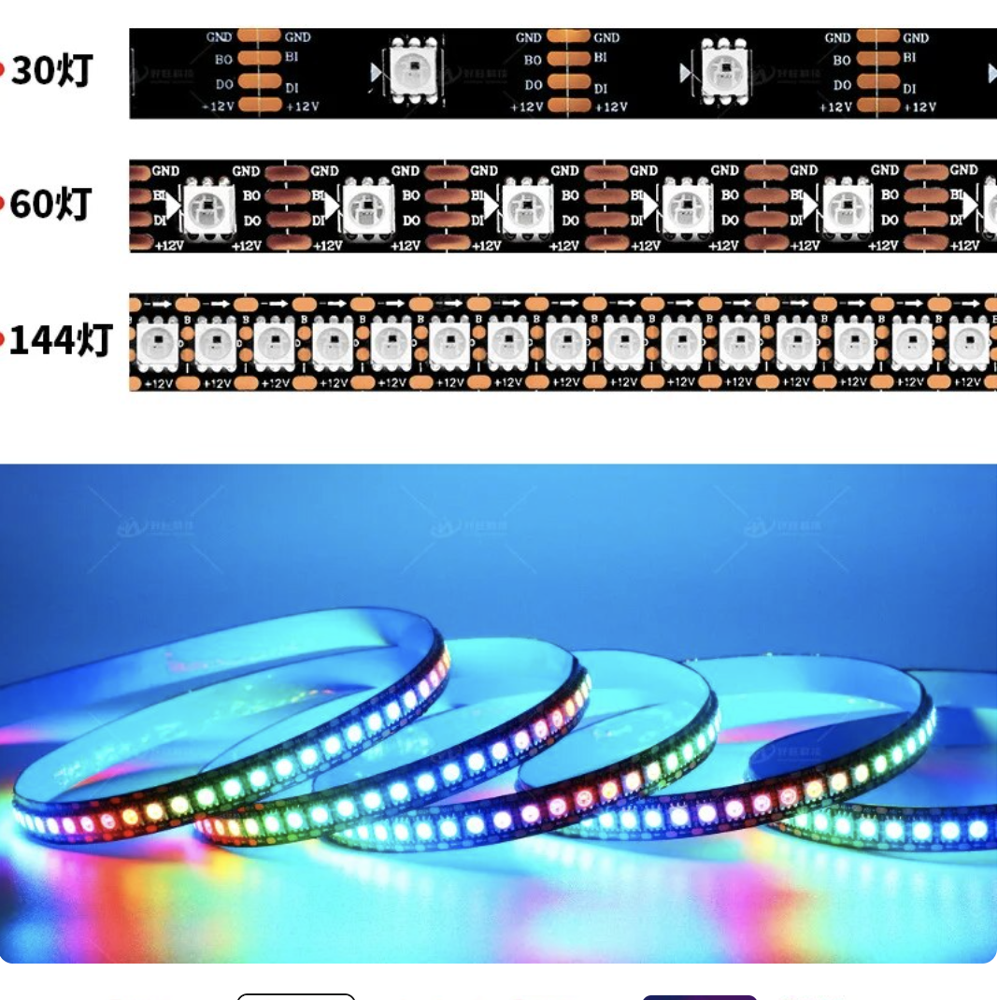
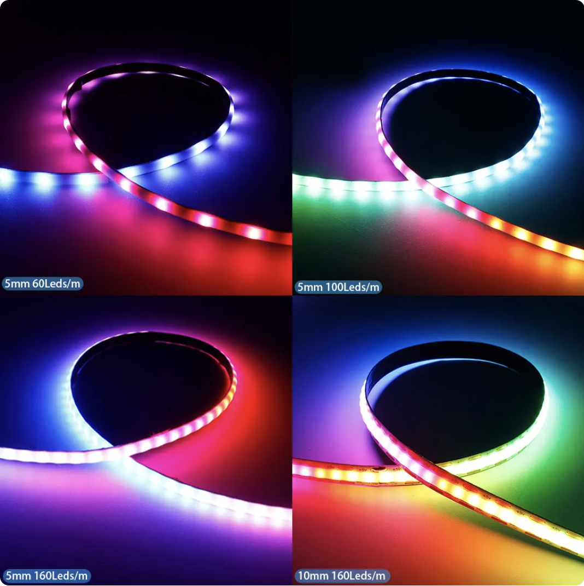
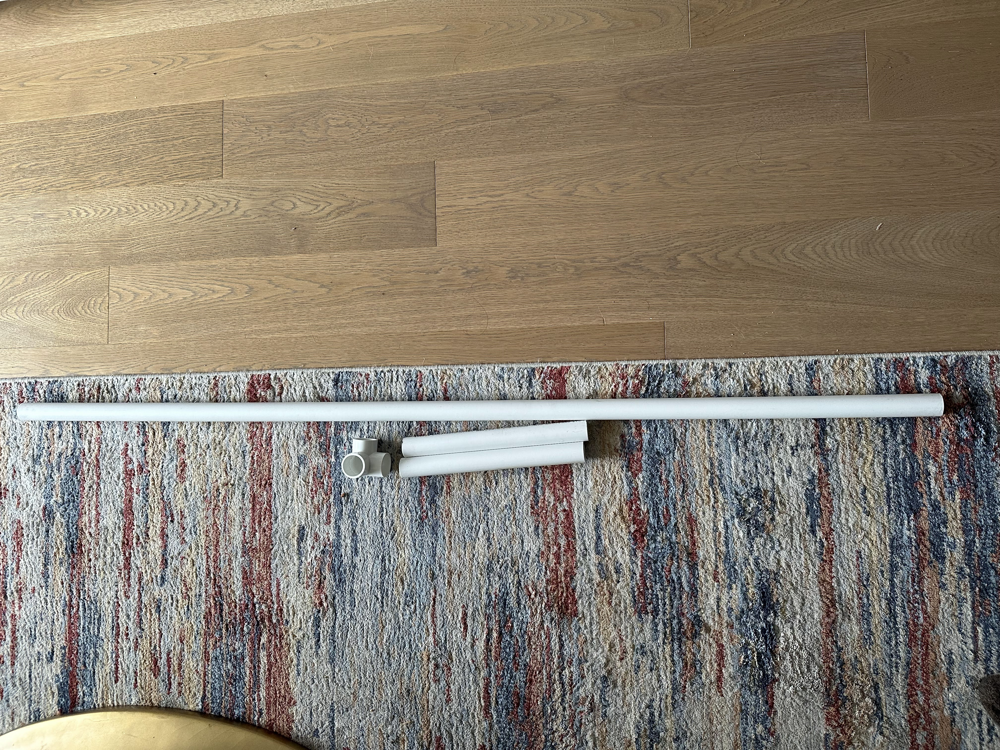
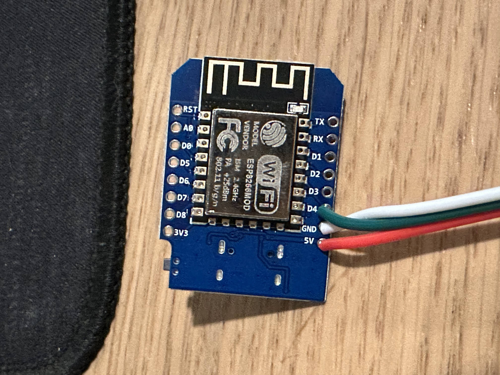
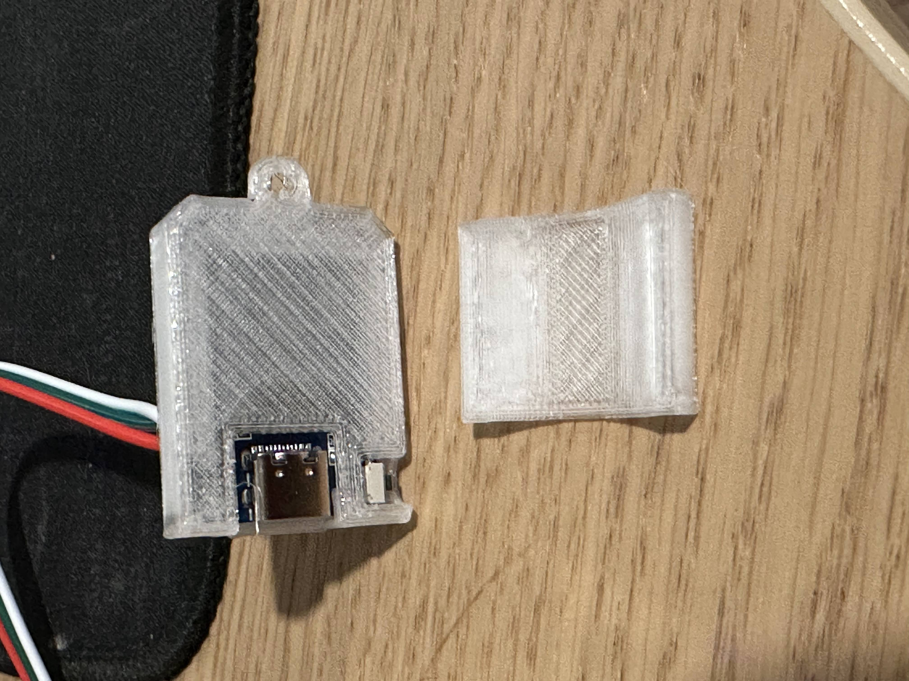
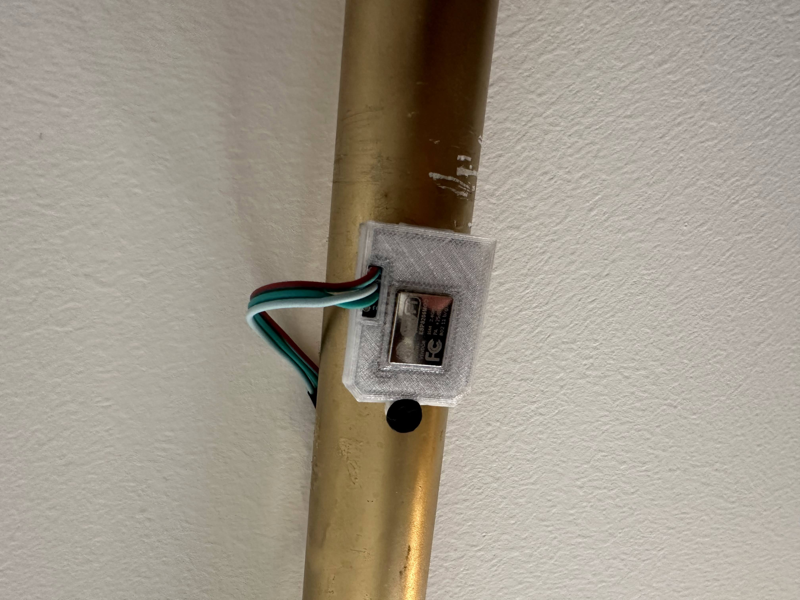
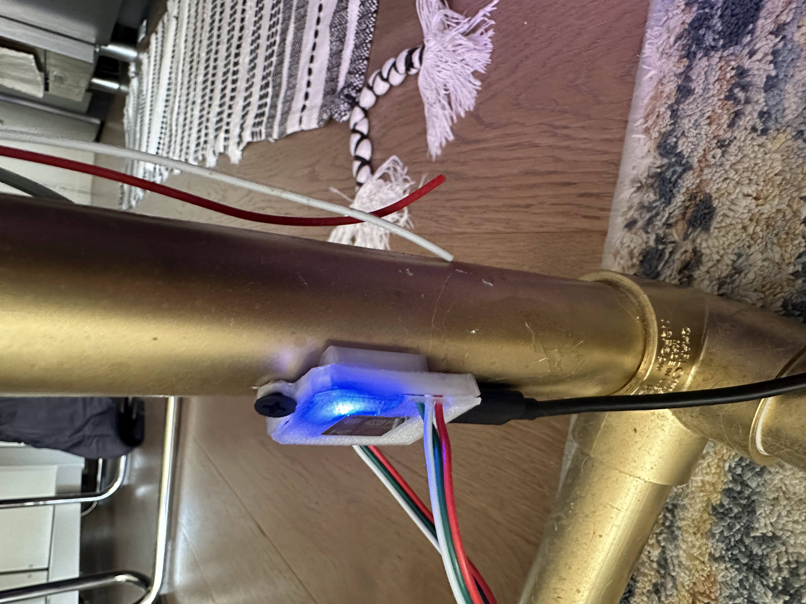
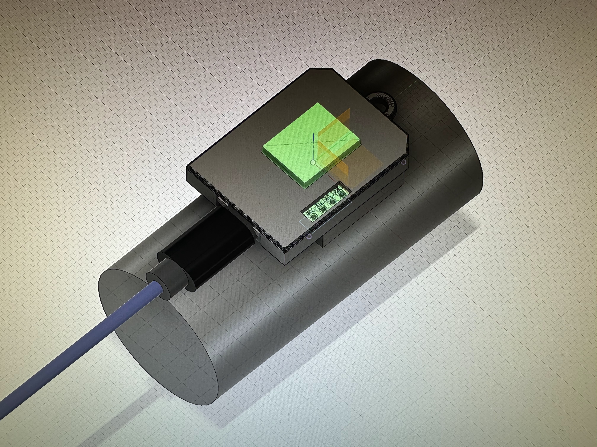

# ext-LED-Lamps
 This is a DIY project to build WLED based accent lamps

# Tools Required:
 - 3D Printer
 - Soldering Iron
 - Drill
 - Hacksaw or Pipe Cutter

 # Selecting you LEDs
 
 There are many different types of WS2812 leds avaliable in differnt pacakages from 5050SMD to COB. From subjective testing i've found using an led strip with a density between 60 LEDs/meter to 1600/LEDs per meter is a good range.

 30 LEDs/meter has too much space between LEDs and results in courser color transitions
 Here is an example of a lamp made with 30LED/m
 

Here is a comparason of the LED density options:
 

 # BOM
 ## V1 Lamp (5050SMD LEDs | 60 LEDs/Meter)

This is the BOM for a single lamp

| Item Name      | Quantity | Description                          | 
|----------------|----------|--------------------------------------|
| WS2812B 2mft   | 1        | WS2812B RGB 16.4FT 300Pixels/m       | 
| ESP8266        | 1        | ESP8266 ESP-12F Type-C USB           | 
| 3 pin con      | 1 (10pck)| 10 Pairs 3pin JST SM Female/Male Con | 
| 1" x 10ft pcv  | 1        | 1 in. x 10 ft. White PVC Schedule 40 | 
| 1" 90o elbow   | 3        | 1 in 90o Socket x Hub PVC Elbow      | 
| USB Cable      | 1        | 5 Pack of USB Cables                 | 
| 5V 2A Charger  | 1        | 3 Pack of USB Chargers               | 
| Spray Paint    | 1        | can of sparay paint                  |

Since most of the materials don't ship in small quantities, its more cost efficient to make 2-3 lamps than just one.
Here is a BOM for a set of 3 V1 lamps

| Item Name      | Quantity | Description                          | Price          | URL                            |
|----------------|----------|--------------------------------------|----------------|--------------------------------|
| WS2812B 5m     | 1        | WS2812B RGB 16.4FT 300Pixels/m       | $22.00         | https://a.co/d/akVGvSk         |
| ESP8266 3 pack | 1 (3pack)| ESP8266 ESP-12F Type-C USB           | $11.00         | https://a.co/d/6nqaI22         |
| 3 pin con      | 1 (10pck)| 10 Pairs 3pin JST SM Female/Male Con | $7.00          | https://a.co/d/aJJjx0d         |
| 1" x 10ft pcv  | 3        | 1 in. x 10 ft. White PVC Schedule 40 | $24.00 ($8 x3) | https://tinyurl.com/MainPipe   |
| 1" 90o elbow   | 3        | 1 in 90o Socket x Hub PVC Elbow      | $15.00 ($5 x 3)| https://tinyurl.com/SideOutlit |
| USB Cable      | 1(5 pack)| 5 Pack of USB Cables                 | $10.00         | https://a.co/d/fZhfnr1         |
| 5V 2A Charger  | 1(3 pack)| 3 Pack of USB Chargers               | $9.00          | https://a.co/d/6ZhHEuX         |
| Spray Paint    | 1        | can of sparay paint                  | $5.00          |                                |
|     Total:     |          |                                      | $103           |                   

Building 3 lamps results in a cost of $103 ($34 per lamp)

# V2 Lamp BOM
This revision uses the COB version of WS2812 for a smoother diffusion, but slightly higher BOM cost:
I suggest using 100 LED/meter or 160 LED/meter strips
 

 These LEDs are quite expensive on Amazon ($45 per 5M https://a.co/d/8PYUwIp) vs Aliexpress ($30 per 5M https://a.aliexpress.com/_mrHvg3G )

| Item Name      | Quantity | Description                          | Price          | URL                               |
|----------------|----------|--------------------------------------|----------------|-----------------------------------|
| WS2812B 5mft   | 1        | WS2812 COB 160Leds/m                 | $27.00         | https://a.aliexpress.com/_mrHvg3G |
| ESP8266 3 pack | 1 (3pack)| ESP8266 ESP-12F Type-C USB           | $11.00         | https://a.co/d/6nqaI22            |
| 3 pin con      | 1 (10pck)| 10 Pairs 3pin JST SM Female/Male Con | $7.00          | https://a.co/d/aJJjx0d            |
| 1" x 10ft pcv  | 3        | 1 in. x 10 ft. White PVC Schedule 40 | $24.00 ($8 x3) | https://tinyurl.com/MainPipe      |
| 1" 90o elbow   | 3        | 1 in 90o Socket x Hub PVC Elbow      | $15.00 ($5 x 3)| https://tinyurl.com/SideOutlit    |
| USB Cable      | 1(5 pack)| 5 Pack of USB Cables                 | $10.00         | https://a.co/d/fZhfnr1            |
| 5V 2A Charger  | 1(3 pack)| 3 Pack of USB Chargers               | $9.00          | https://a.co/d/6ZhHEuX            |
| Spray Paint    | 1        | can of sparay paint                  | $5.00          |                                   |
|     Total:     |          |                                      | $107           |  

 # Assembly Instructions
 These instructions are for a single Lamp, feel free to scale accordingly.

1. Cut the 1" x 10 ft pipe into the following:
  a. 1 x 5ft section
  b. 2 x 1 ft sections

  

2. Join the 5ft section with the 2x1ft sections using the 90 degree coupler

3. 3D print the following files from ME/3D Print Outputs:
   a. Lamp_Shim.stl
   b. plug-lamp v1.stl  Qty: 3
   c. Wemos_Bottom.stl
   d. wemos_top.stl
  

4. Spray paint the joined pipe section

5. glue the plug-lamp v1.stl plugs on each of the 3 pipe ends

6. Solder wires onto the esp8266 and install it into the plastic housing. Note you need to attache the lid before you solder the wires.
   a. Connect Red to 5V, Green to D4, White to GND

7. use superglue to connect the shim to the main plastic
   

8. Drill a small pilot hole in the pole, then use a screw to attache the esp8266 to the pole
   

This is how the stackup should look
   

CAD model for reference:

